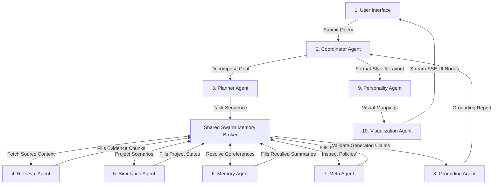

# Multi-Agent Swarm Architecture - Antigravity AI OS

This contract details the roles, communication graphs, boundaries, and shared workspace memory specifications of the multi-agent swarm system (Milestone 13).

---

## 1. Swarm Agent Registry

| Agent Role | Boundary Class | Core Responsibilities | Inputs | Outputs |
|---|---|---|---|---|
| **Coordinator** | `SwarmCoordinator` | Orchestrates queries and assigns sub-tasks to agents. | User Query | Unified Swarm Response |
| **Planner** | `PlannerAgent` | Decomposes goals into sequential steps. | Target Goal | Task Checklist |
| **Simulation Agent** | `SimulationAgent` | Evaluates hypothetical scenarios and projects stability risks. | Projected Variables | WorldStateNode / Risk Score |
| **Memory Agent** | `MemoryAgent` | Manages active conversational context and summary decay logs. | Chat Turn | Recalled context |
| **Retrieval Agent** | `RetrievalAgent` | Runs vector and semantic search queries (ChromaDB, CLIP). | Keyword / Image Query | EvidenceNode Array |
| **Grounding Agent** | `GroundingAgent` | Verifies facts and claims to prevent hallucinations. | Generated Claims | Verification Score |
| **Tool Agent** | `ToolAgent` | Runs physical shell tools, parsing engines, and transcribers. | Tool Arguments | Execution Output |
| **Personality Agent**| `PersonalityAgent` | Formats output styles to match tone preferences. | Output Text | Stylized Response |
| **Meta Agent** | `MetaAgent` | Traces strategy execution rates and refines search rules. | Run Failures | Refined Routing Policy |
| **Visual Agent** | `VisualizationAgent` | Generates graph nodes, timelines, and SVG schemas. | Graph Data | ReactFlow Node-Link Array |

---

## 2. Swarm Communication Graph

Agents communicate asynchronously using the shared broker workspace (`app/swarm/message_broker.py`). The coordinator handles final consensus resolution (`app/swarm/negotiation_consensus.py`).

---

## 3. Negotiation Consensus Protocol

When agents submit conflicting suggestions (e.g., the Retrieval Agent proposes a text fallback but the Simulation Agent flags port connectivity issues):
1. **Consensus Scoring:** The Coordinator calculates a consensus score (`calculate_consensus_score`) based on agent confidence levels and success history.
2. **Consensus Resolution:** The Coordinator executes `resolve_agent_consensus` to determine the safest execution path.
3. **Execution Trace Logging:** The final sequence of tool executions and observations is saved to the trace log.
