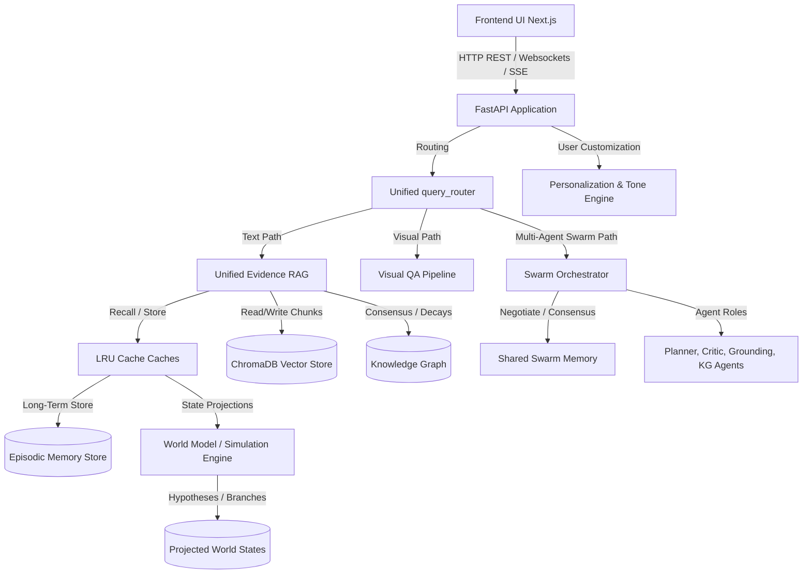
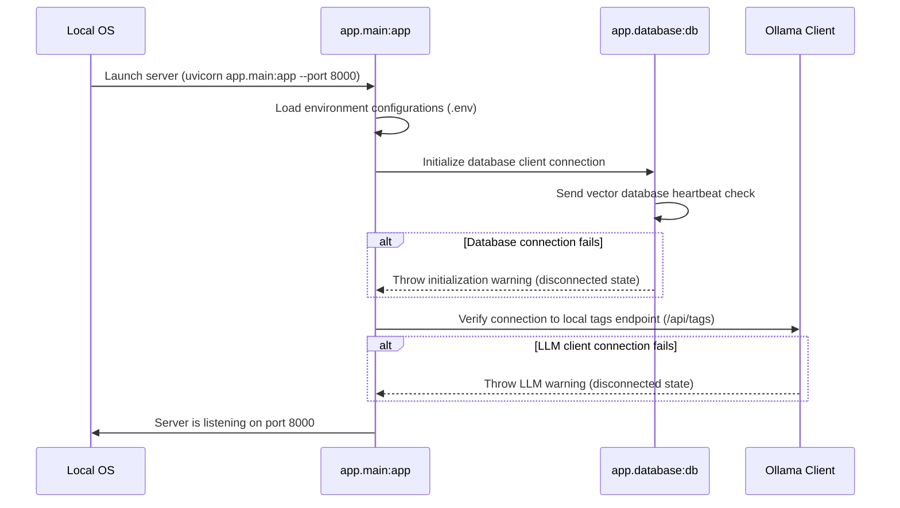
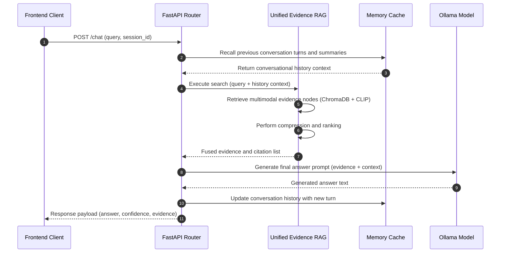

# System Overview & Architecture Contract - Antigravity AI OS

This contract defines the core pipeline architecture, startup sequences, execution ordering, and data flow specifications of the backend application for the RAG PRO AI Operating System (Milestones 1–18).

---

## 1. System & Architecture Overview

The system runs as an offline-first RAG and simulation engine. It exposes REST, SSE, and WebSocket endpoints to interface with the Next.js frontend client.



---

## 2. Directory Tree & Pipeline Subsystems

The backend source structure consists of these core modules:

```
app/
├── main.py                     # Entry point exposing API endpoints
├── config.py                   # Configuration parameters, thresholds, and toggle flags
├── database.py                 # SQLite and persistent ChromaDB vector store clients
├── embedding/                  # Embedding generation clients (SentenceTransformers, CLIP)
├── ingestion/                  # Parsing pipelines (PDF, DOCX, audio transcribers)
├── episodic/                   # Long-term memory episode stores, replays, and clustering
├── learning/                   # Discovered behavior patterns, feedback, and pattern discovery
├── meta/                       # Meta-cognitive routing, planner strategies, and tool leaderboards
├── personality/                # Personalization preference models and adaptive visual profiles
├── retrieval/                  # Retrievers, compressor filters, and consensus engines
├── simulation/                 # World model state projections and counterfactual reasoning
├── swarm/                      # Multi-agent swarm brokers and negotiation states
├── ui/                         # Layouts, telemetry dashboards, themes, and workspace managers
└── utils/                      # Helper methods (concurrency locks, file system readers)
```

---

## 3. Configuration System & Flags

The configurations default parameters are detailed in `app/config.py`.

| Subsystem Flag | Config Flag Name | Default | Purpose |
|---|---|---|---|
| **RAG** | `ENABLE_GROUNDING_VALIDATION` | `True` | Runs grounding claims analysis on outputs. |
| **Memory** | `ENABLE_MEMORY` | `True` | Controls active conversation session memory. |
| **Agents** | `ENABLE_AGENTIC_RAG` | `True` | Toggle for single-agent planning loop. |
| **Graph** | `ENABLE_KNOWLEDGE_GRAPH` | `True` | Toggle for semantic entity-centric memory graphs. |
| **Learning**| `ENABLE_SELF_LEARNING` | `True` | Discovers user behavior correction patterns. |
| **Swarms** | `ENABLE_MULTI_AGENT_SWARM` | `True` | Toggle for multi-agent swarm collaboration. |
| **Simulations**| `ENABLE_SIMULATION_ENGINE` | `True` | Runs counterfactual projections. |
| **UI** | `ENABLE_UI_LAYER` | `True` | Exposes dashboards, visual themes, and workspace APIs. |

---

## 4. Startup & Execution Sequences

### Startup Sequence


### Request Lifecycle (Conversational Chat Flow)


---

## 5. Storage & Caching Layers

The system maintains distinct cache parameters and directories for fast retrievals:

* **Vector Database:** Persistent ChromaDB files stored under `storage/db`.
* **Uploads Directory:** Uploaded files stored under `storage/uploads`.
* **Caching Architecture:**
  * **UI Caches (`app/ui/ui_cache.py`):** Theme cache (50 entries capacity), Dashboard metrics cache (10), ReactFlow Graph visualization cache (20), Workspace folders cache (100).
  * **Graph Cache (`app/retrieval/graph_cache.py`):** Caches entities and relation paths.
  * **Simulation Cache (`app/simulation/world_model_cache.py`):** Caches predicted world state projections.
  * **Meta Cache (`app/meta/policy_cache.py`):** Caches planning policy rankings.
