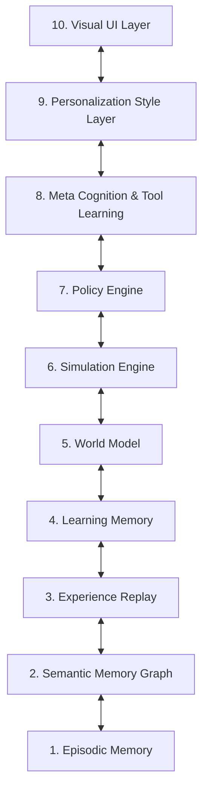

# Cognitive Architecture - Antigravity AI OS

This contract defines the cognitive layers, memory structures, simulation loops, meta cognitive subsystems, and personalized output filters of the RAG PRO system.

---

## 1. Cognitive Layer Inter-Relationship Diagram

The cognitive architecture operates as a hierarchical loop:

---

## 2. Subsystem Functional Contracts

### 1. Episodic Memory (Long-Term Chronology)
* **Description:** Represents unique conversational turns, events, and settings changes.
* **Component:** `app.episodic`
* **Interaction Flow:** Incoming interactions are parsed into `EpisodeNode` models. When a user asks questions, relevant historic episodes are loaded to establish context.

---

### 2. Semantic Memory (Knowledge Graph)
* **Description:** The persistent entity-centric database mapping definitions, canonical aliases, and co-occurrences.
* **Component:** `app.retrieval.graph_store`
* **Interaction Flow:** Entity extractors parse entity matches from source documents. Relationships are established with co-occurring entities to construct the base knowledge graph.

---

### 3. Experience Replay (Execution Reinforcement)
* **Description:** Replays past planning attempts to identify optimized tool paths.
* **Component:** `app.episodic.episodic_store`
* **Interaction Flow:** When the planner encounters a task, the meta cognitive engine runs similarity checks on past replays (`PolicyReplayNode`) to select the best policy.

---

### 4. Learning Memory (Adaptive Adjustments)
* **Description:** Tracks discovered correction coefficients, patterns, and feedback loops.
* **Component:** `app.learning.learning_store`
* **Interaction Flow:** When the Grounding Agent catches inaccuracies or when the user corrects the output, adjustments are written to `learning_memory.json` to modify future prompt retrieval parameters.

---

### 5. World Model (Projected States Database)
* **Description:** Local database projecting state configurations, variables, and status parameters.
* **Component:** `app.simulation.simulation_store`
* **Interaction Flow:** Compiles current conditions into a structured `WorldStateNode` project frame.

---

### 6. Simulation Engine (Branch Projector)
* **Description:** Projects future execution steps and evaluates stability risk indices.
* **Component:** `app.simulation.simulation_models`
* **Interaction Flow:** Evaluates hypothetical scenario branches (`ScenarioNode`) based on current state parameters to detect risks.

---

### 7. Policy Engine (Execution Selector)
* **Description:** Selects the best policy strategy (ReAct vs Plan-and-Solve) to carry out actions.
* **Component:** `app.meta.meta_store`
* **Interaction Flow:** Dispatches task sequences to the active agent planner based on past success rates.

---

### 8. Meta Cognition (Evaluation Logger)
* **Description:** Evaluates tool success rates, records tool execution latencies, and compiles reflections.
* **Component:** `app.meta.meta_models`
* **Interaction Flow:** Compiles self-reflection statements (`MetaReflectionNode`) upon run errors to refine search rules.

---

### 9. Personalization Layer (Tone & Layout Engine)
* **Description:** Formats output text according to active user tone settings, verbosities, and visual themes.
* **Component:** `app.personality.personality_store`
* **Interaction Flow:** Resolves tone profiles (`HumanPreferenceNode`) during text generation steps to match style configurations.

---

### 10. Visual UI Layer (Renderer Selector)
* **Description:** Visual client components mapping state variables, folders, and assets.
* **Component:** `app.ui.ui_api`
* **Interaction Flow:** Selects the correct renderer (ReactFlow canvas, code editor, waveform indicator) based on output file extensions and modalities.
