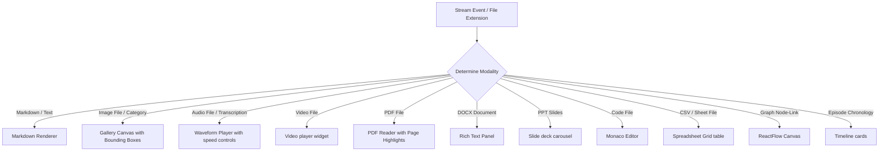

# Lovable AI Generation Context - RAG PRO OS Frontend

> [!IMPORTANT]
> **THIS IS NOT A NORMAL CHATBOT.**
> Do not generate a simple, generic input-and-output chat interface. This application is an **AI-powered Operating System canvas** inspired by the user interfaces of **Claude Desktop, Cursor, Perplexity, Apple Intelligence, Arc Browser, and Notion**. 

This document serves as the conceptual guide and layout blueprint for Lovable AI to generate the frontend of the system.

---

## 1. Visual & Layout Concept

The RAG PRO OS interface is structured as an **interactive split-screen workspace**, not a static message feed:

```
+-------------------------------------------------------------------------+
| [Workspace Explorer] |         [Chat Canvas]          | [Split-View Pane] |
|                      |                                |                   |
| - config.py          | User: What port is Chroma on?   | (ReactFlow Graph  |
| - database.py        |                                |  or Monaco Editor |
| - uploads/           | AI: Chroma runs on 8000. [1]   |  or PDF preview)  |
|                      |                                |                   |
|                      | +----------------------------+ |                   |
|                      | | (Inline Citation Card)     | |                   |
|                      | +----------------------------+ |                   |
+----------------------+--------------------------------+-------------------+
| [Voice Overlay (Waveform)]                 [Developer Telemetry dashboard]|
+-------------------------------------------------------------------------+
```

---

## 2. Core Layout Elements

### A. Central Chat Canvas
* **Interaction Mode:** Centered chat feed.
* **Inline Elements:** Renders bold, lists, and tables inline as text tokens flow from `/ui/chat/stream`. Shows inline numbered citation chips (e.g., `[1]`, `[2]`).
* **Hover Actions:** Hovering over an inline citation shows a popover preview containing text snippets and source details. Clicking the citation highlights the file in the workspace explorer and loads the document preview in the split-view pane.

---

### B. Secondary Split-View Panes
The user interface supports splitting the screen to display secondary widgets:

* **ReactFlow Canvas:** Node-link network charts tracing memory connections, active entities, and co-occurrences.
* **Monaco Code Editor:** Renders local source files with auto-save triggers, tabs, and folders.
* **Document Viewer:** Handles PDF pages, DOCX layouts, and slide carousels.
* **Simulation Projections:** Displays forecast branch paths and interactive variables.

---

## 3. Dynamic Modality Dispatcher

The interface must dynamically launch dedicated visual components based on the incoming stream modality or file extension:



---

## 4. Design Aesthetics (Aesthetics Rules)
* **Glassmorphism:** Use glass cards (`backdrop-filter: blur(16px)`) with subtle borders to layer elements over the background.
* **Typography:** Use modern font scales (Inter for headers, Roboto Mono / JetBrains Mono for code blocks and values).
* **Animations:** Include micro-animations for actions (e.g. glowing borders during thinking phases, waving waveform signals during recordings, flowing dashed edges on active graph links).
