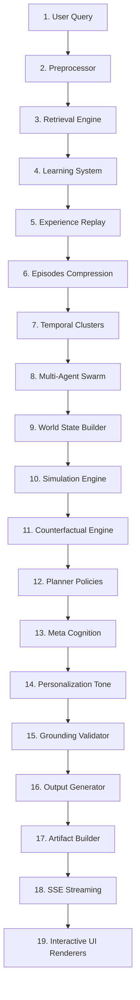

# Pipeline Architecture Manual - Antigravity AI OS

This document maps the complete execution flow of the RAG PRO system, tracing a user request from the initial interface trigger down through the semantic, cognitive, agentic, simulated, and validator pipelines.

---

## 1. End-to-End Execution Pipeline

---

## 2. Pipeline Subsystem Details

### 1. User Query Input
* **Trigger:** Received via REST `POST /chat` or SSE `GET /ui/chat/stream`. Contains text query and session parameters.

### 2. Preprocessor (Coreference & Focus Tracking)
* **Actions:** Resolves pronouns (pronoun coreference tracking) based on active topic scoring anddecay focus states from preceding conversation turns.

### 3. Retrieval Engine (Multi-Modal Retrieval)
* **Actions:** Queries the vector database (ChromaDB) for text fragments and runs visual search (CLIP) for candidates.

### 4. Learning System (Pattern Discovery)
* **Actions:** Checks historically discovered user correction patterns, patterns, and feedback loops to adapt retrieval context query parameters.

### 5. Experience Replay
* **Actions:** Replays previous similar queries and outcomes to discover optimized execution routes.

### 6. Episodes (Long-Term Storage)
* **Actions:** Archives the turn transaction as an episodic memory node with importance ratings.

### 7. Temporal Clusters
* **Actions:** Groups episodes into semantic subject clusters to build topic timelines.

### 8. Multi-Agent Swarm
* **Actions:** Planner Agent divides tasks, executing them across specialized agents (Retrieval, KG, Critic, Grounding agents) using shared swarm memory negotiations.

### 9. World State Builder
* **Actions:** Compiles current conditions into a structured `WorldStateNode` project frame.

### 10. Simulation Engine
* **Actions:** Projects future states and assesses risk scores for target configurations.

### 11. Counterfactual Engine
* **Actions:** Evaluates alternative outcomes if variables are modified (e.g. changing PORT).

### 12. Planner Policies
* **Actions:** Selects the best policy strategy (ReAct vs Plan-and-Solve) to carry out actions.

### 13. Meta Cognition (Tool Learning)
* **Actions:** Evaluates tool success rates, records tool execution latencies, and compiles reflections.

### 14. Personalization Layer
* **Actions:** Formats output text according to active user tone settings, verbosities, and visual themes.

### 15. Grounding Validator
* **Actions:** Validates claims using fact-checking validators to prevent generation hallucinations.

### 16. Output Generator
* **Actions:** Assembles raw generation tokens, citations, reasoning details, and metadata.

### 17. Artifact Builder
* **Actions:** Checks if outputs match Rich Artifact formats (tables, images, charts, code, files).

### 18. SSE Streaming
* **Actions:** Streams text tokens and metadata to the client using Server-Sent Events.

### 19. UI Renderer Dispatcher
* **Actions:** Visual client loads the correct component (ReactFlow canvas, code editor, waveform indicator) according to the stream modality.
