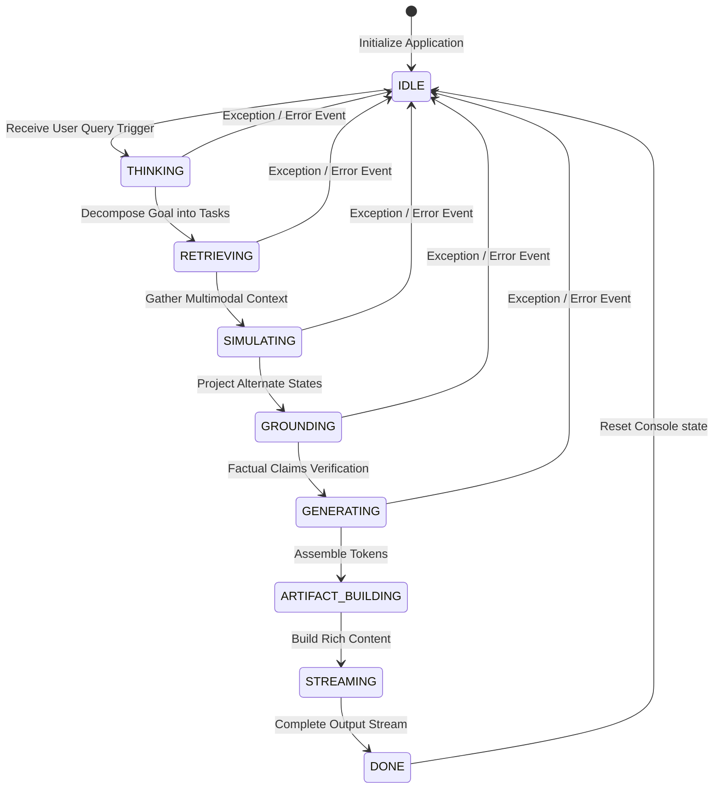

# State Machine Reference - Antigravity AI OS

This contract defines the execution states, transitions, triggers, and WebSocket/SSE event targets for the RAG PRO system. It guides the frontend in rendering appropriate animations and progress indicators during processing.

---

## 1. State Transition Lifecycle

The backend transitions through these states during query execution:

---

## 2. State Transition Reference

| State | Purpose | Transition Trigger | Actions | WebSocket / SSE Event | UI Visual / Animation |
|---|---|---|---|---|---|
| **IDLE** | System is ready. | App launch or query completion. | Clear temporary caches and reset query variables. | `event: status {"state": "idle"}` | Minimal status pulse indicator; interactive text input field. |
| **THINKING** | Agent planner parses query. | User message submit. | Analyze pronouns; decompose goals into subtasks. | `event: thinking` | Glowing input border; floating loading dots. |
| **RETRIEVING**| Retrieves text and image nodes. | Task checklist dispatch. | Query ChromaDB and CLIP collections. | `event: tool_call`, `event: tool_result` | Citation loader card; searching database indicator. |
| **SIMULATING**| Runs world model projections. | Context aggregation. | Evaluate alternative outcomes and risk scores. | `event: simulation_hit` | Rendering projected forks on simulation canvas. |
| **GROUNDING** | Verifies factual accuracy. | Raw response compiled. | Execute claim consensus verification. | `event: status {"state": "grounding"}` | Claim validator status checker badge. |
| **GENERATING**| Generates final output tokens. | Claims approved. | Format text based on user preference templates. | `event: token` | Markdown text scrolling inline. |
| **ARTIFACT_BUILDING** | Evaluates Rich Artifact templates. | Formats complete. | Check output content types. | `event: status {"state": "artifact_building"}` | Floating code/table editor sidebar animation. |
| **STREAMING** | Sends tokens to interface. | Output stream start. | Send chunks over network connection. | `event: done` | Scrolling code blocks, rendering tables. |
| **DONE** | Execution complete. | Stream termination token. | Save transactional memory entries. | `event: done` | Highlights citations and updates status indicator. |
